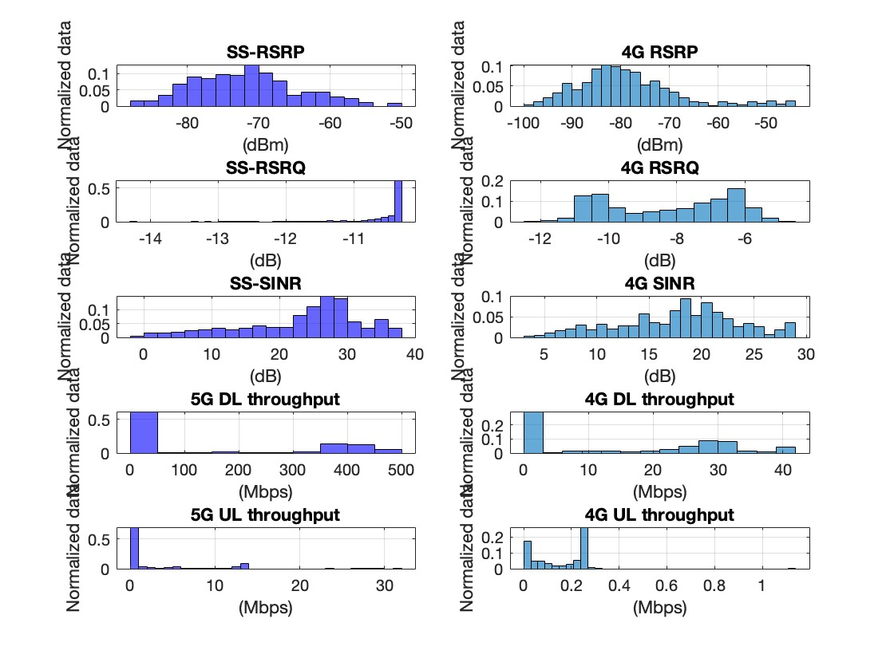
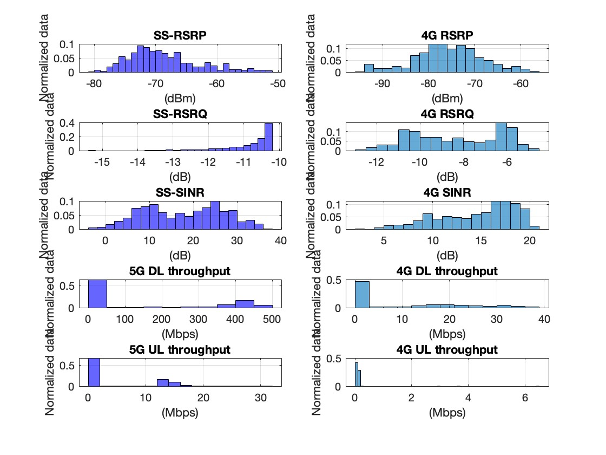
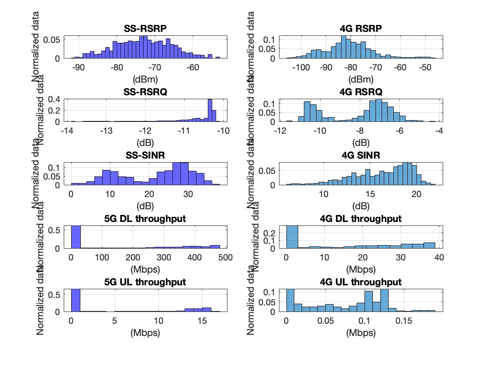

# 5G Postlab

A project in my 5G class, QualiPoc and G-NetTrack Pro app were 2 mobile applications that were used to measure the 
performance of the 4G and 5G mobile network in three floors of KampusAreena building. 
The measurement attributes were extracted as CSV files and I used Matlab to generate the figures to evaluate and write a report based 
on these figures as a group.

## Floor 0 (library)

## Floor 1

## Floor 2

